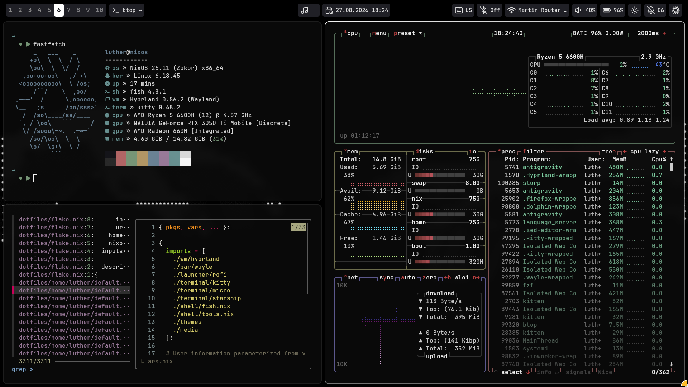
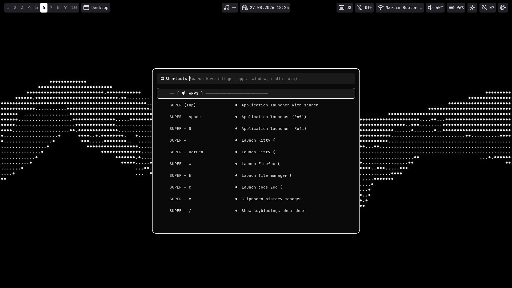

<div align="center">

```text
     _   ___    _      
    +o\  \  \  / \     
    \oo\  \  \/  /     
  ,oo+oo+oo\   ,/ +\   
 <oooooooooo\  \ /os;  
     /``/    \  ,oo/   
,─~─'  /      \,oooooo,
\__   ;s      /oo/sss>`
  /  /so\____/ss/____  
 `, / \oo\   ```     / 
  \/ /sooo\─~.  .─~─`  
    /so/\oo\  \  \     
    \o/  \s+\  \_/     
          ```          
```

# dotfiles

[](https://nixos.org)
[](https://hyprland.org)
[](https://wayle.app)
[](./LICENSE)

Personal NixOS and Home Manager configuration with Hyprland and Wayle. Fully configured from a single file (`vars.nix`).

</div>

---

## Showcase





---

## Environment Details

| Component | Program | Description |
| :--- | :---: | :--- |
| **Operating System** | [NixOS](https://nixos.org/) | Declarative Linux system with Flakes & Home Manager |
| **Window Manager** | [Hyprland](https://hyprland.org/) | Dynamic Wayland compositor configured with Lua modules |
| **Status Bar** | [Wayle](https://wayle.app/) | Wayland bar, control center & native `hyprsunset` module |
| **Terminal** | [Kitty](https://sw.kovidgoyal.net/kitty/) | GPU-accelerated terminal with scrollback search |
| **Shell & Prompt** | [Fish](https://fishshell.com/) + [Starship](https://starship.rs/) | Interactive shell with `nh` shortcuts and dynamic variables |
| **App Launcher** | [Rofi](https://github.com/davatorium/rofi) | Application launcher, wallpaper picker & cheatsheet |
| **File Manager** | [Dolphin](https://apps.kde.org/dolphin/) | Standalone Qt6 dark theme with thumbnailers |
| **Code & Text Editors** | [Zed](https://zed.dev/) & [Micro](https://micro-editor.github.io/) | Fast graphical IDE and terminal editor with custom dark theme |
| **Media Player** | [Celluloid](https://celluloid-player.github.io/) / [MPV](https://mpv.io/) | Hardware-accelerated video playback with `uosc` interface |
| **Image Viewer** | [Loupe](https://apps.gnome.org/Loupe/) | Modern Wayland image viewer |
| **Screen Capture** | [Grim](https://sr.ht/~emersion/grim/) + [Slurp](https://github.com/mval浊/slurp) | Area & full screenshots with `wf-recorder` screen recording |
| **Session Security** | [Hyprlock](https://wiki.hypr.land/Hypr-Ecosystem/hyprlock/) + [SDDM](https://github.com/sddm/sddm) | Qt6 Astronaut theme & PAM GNOME Keyring auto-unlock |
| **Performance** | [Feral GameMode](https://github.com/FeralInteractive/gamemode) | Automatic CPU governor & GPU performance tuning |
| **GTK & Qt Theme** | `adw-gtk3-dark` + `Breeze` | Dark monochrome palette across GTK and Qt apps |
| **Icons & Cursors** | `Tela-circle-dark` / `Bibata` | Minimalist circular icon theme & smooth cursor |
| **Typography** | `JetBrainsMono Nerd Font` | Developer monospace font with ligatures |

---

## Configuration (`vars.nix`)

All personal parameters, device toggles, and hardware choices are centralized in [`vars.nix`](file:///home/luther/dotfiles/vars.nix):

```nix
{
  # User Profile & Identity
  username = "luther";
  name = "Your Name";
  email = "your-email@example.com";
  hostname = "nixos";

  # Device form-factor (controls battery module visibility)
  isLaptop = true;

  # GPU driver selection ("hybrid-amd-nvidia", "nvidia", "amd", "intel", "vm")
  gpuDriver = "hybrid-amd-nvidia";

  # Desktop Preferences
  terminal = "kitty";
  browser = "firefox";
  fileManager = "dolphin";
  editor = "zeditor";

  # Input & Sensitivity
  kbLayout = "us,ru,ua";
  kbOptions = "grp:alt_shift_toggle";
  mouseSensitivity = -0.7;

  # Theming & Colors
  font = "JetBrainsMono Nerd Font";
  fontSize = 12;
  rounding = 10;
  borderSize = 2;
  colorBg = "#0a0a0a";
  colorAccent = "#ffffff";
}
```

---

## Keybindings

| Shortcut | Action | Description |
| :--- | :--- | :--- |
| **`Super + Space`** / **`Super`** *(tap)* | App Launcher | Open Rofi application search |
| **`Super + /`** | Shortcuts Cheatsheet | Dynamic searchable keybindings popup |
| **`Super + Return`** / **`Super + T`** | Terminal | Launch Kitty terminal |
| **`Super + W`** | Web Browser | Open default browser |
| **`Super + E`** | File Manager | Open Dolphin with full MIME associations |
| **`Super + C`** | Code Editor | Open Zed editor |
| **`Super + V`** | Clipboard Manager | Search clipboard history (`cliphist` + Rofi) |
| **`Super + A`** | Control Center | Toggle Wayle control center |
| **`Super + Shift + W`** | Wallpaper Picker | Interactive wallpaper selector with live preview |
| **`Super + Escape`** | Power Menu | Lock, reboot, logout, or shut down |
| **`Ctrl + Alt + Delete`** | Task Manager | Floating `btop` system monitor |
| **`Print`** / **`Super + Shift + S`** | Screenshot Area | Interactive area capture to clipboard & disk |
| **`Shift + Print`** | Fullscreen Screenshot | Capture active display output |
| **`Super + Alt + R`** | Screen Recording | Toggle video screen recording (`wf-recorder`) |
| **`Super + Q`** | Close Window | Close focused window |
| **`Super + F`** | Toggle Floating | Switch window between tiling and floating mode |
| **`Super + M`** | Toggle Fullscreen | Maximize window to fullscreen |
| **`Super + 1..0`** | Workspace 1..10 | Switch between desktop workspaces |
| **`Super + Alt + 1..0`** | Move to Workspace | Send focused window to workspace silently |

---

## Repository Structure

```
.
├── flake.nix                          # Flake inputs, NixOS & Home Manager outputs
├── flake.lock                         # Locked dependency versions
├── vars.nix                           # Centralized variables & identity parameters
├── imgs/                              # Repository screenshots and gallery preview
├── wallpapers/                        # Default desktop wallpaper
├── hosts/
│   ├── common/                        # Shared system modules
│   │   ├── hardware/                  # Modular GPU drivers (NVIDIA, AMD, Intel, VM)
│   │   │   ├── amd.nix
│   │   │   ├── default.nix
│   │   │   ├── intel.nix
│   │   │   ├── nvidia.nix
│   │   │   └── vm.nix
│   │   ├── sddm/                      # Standalone Qt6 SDDM configuration & theme
│   │   │   ├── default.nix
│   │   │   └── theme.conf.user
│   │   ├── audio.nix                  # PipeWire sound server & low-latency audio
│   │   ├── core.nix                   # Bootloader, locale, Feral GameMode & nh helper
│   │   ├── default.nix                # Aggregator of all common system modules
│   │   ├── hyprland.nix               # System-level Hyprland, SDDM, polkit & portals
│   │   └── users.nix                  # User account parameterized via vars.nix
│   └── nixos/                         # Host-specific hardware configuration
│       ├── default.nix
│       └── hardware-configuration.nix
└── home/
    └── luther/                        # Home Manager configuration
        ├── bar/
        │   └── wayle/                 # Wayle bar, control center & hyprsunset config
        │       ├── config/config.toml
        │       └── default.nix
        ├── launcher/
        │   └── rofi/                  # Rofi styles, color templates & wallpaper picker
        │       ├── colors.rasi
        │       ├── config.rasi
        │       ├── default.nix
        │       └── wallpaper.rasi
        ├── media/                     # Media tools, playerctl & desktop scripts
        │   ├── scripts/
        │   │   ├── airplane-mode.sh
        │   │   ├── change-wall.sh
        │   │   ├── cheatsheet.sh
        │   │   ├── find-files.sh
        │   │   ├── powermenu.sh
        │   │   ├── record.sh
        │   │   ├── screenshot.sh
        │   │   └── search.sh
        │   ├── shell/                 # Shell configuration & CLI tools
        │   │   ├── fastfetch/         # Fastfetch specs config & custom ASCII logo
        │   │   │   ├── config.jsonc
        │   │   │   └── logo.txt
        │   │   ├── fish.nix           # Fish shell aliases & nh shortcuts
        │   │   └── tools.nix          # CLI utilities (git, bat, btop, eza, etc.)
        │   └── default.nix
        ├── terminal/
        │   ├── kitty/                 # Kitty terminal config & color templates
        │   │   ├── colors.conf
        │   │   ├── default.nix
        │   │   └── kitty.conf
        │   ├── micro/                 # Micro terminal editor config & color theme
        │   │   ├── colorschemes/custom-dark.micro
        │   │   ├── default.nix
        │   │   └── settings.json
        │   └── starship/              # Starship prompt (config inline in default.nix)
        │       └── default.nix
        ├── themes/                    # Theming, fonts, icons & cursor configuration
        │   ├── default.nix            # GTK/Qt theme links, Breeze & Tela icons
        │   ├── dolphinrc              # Dolphin thumbnailers & UI settings
        │   ├── kdeglobals             # Centralized KDE dark color scheme
        │   └── matugen/               # Matugen templates (dormant/reusable)
        ├── wm/
        │   └── hyprland/              # Hyprland window manager setup
        │       ├── hypridle.conf      # Idle timeout & screen dimming daemon
        │       ├── hyprlock.conf      # Lock screen layout & authentication
        │       ├── default.nix        # Package aggregator & Lua variable injector
        │       └── lua/               # Modular Lua configuration files
        │           ├── animations.lua
        │           ├── autostart.lua
        │           ├── colors.lua
        │           ├── decoration.lua
        │           ├── env.lua
        │           ├── general.lua
        │           ├── init.lua
        │           ├── keybinds.lua
        │           ├── monitors.lua
        │           ├── rules.lua
        │           └── vars.lua
        └── default.nix                # Root Home Manager configuration & XDG MIME
```

---

## Installation & Workflow

### Daily Rebuilds (`nh`)

```bash
nr        # Switch to new configuration (nh os switch)
nrt       # Test configuration without adding boot entry (nh os test)
nrb       # Build and add to boot menu for next restart (nh os boot)
nc        # Clean old Nix store generations (keeps last 3)
nfu       # Update flake.lock input dependencies
perf      # Run command with Feral GameMode governor boost (gamemoderun)
```

*(Fallback: `sudo nixos-rebuild switch --flake .#nixos`)*

---

### Fresh Installation

1. **Clone the repository**:
   ```bash
   git clone https://github.com/luth9r/dotfiles.git ~/dotfiles
   cd ~/dotfiles
   ```

2. **Generate hardware configuration for your machine**:
   ```bash
   nixos-generate-config --show-hardware-config > hosts/nixos/hardware-configuration.nix
   ```

3. **Adjust [`vars.nix`](file:///home/luther/dotfiles/vars.nix)**:
   - Set `username`, `hostname`, and select your `gpuDriver` (`hybrid-amd-nvidia`, `nvidia`, `amd`, `intel`, or `vm`).
   - Set `isLaptop = false` if running on a desktop machine.

4. **Apply configuration**:
   ```bash
   sudo nixos-rebuild switch --flake .#nixos
   ```

---

## License

This repository is licensed under the [MIT License](./LICENSE).
